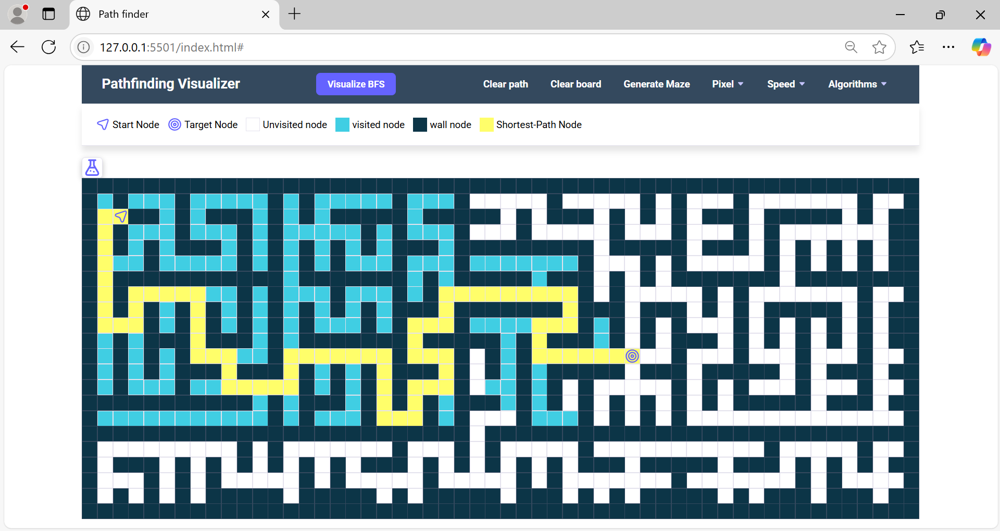

# 🧭 Pathfinding Visualizer

A web-based pathfinding visualizer built using **HTML**, **CSS**, and **JavaScript**. This project helps you visualize different pathfinding algorithms like BFS, DFS, Dijkstra's Algorithm, A\* Algorithm, and more, making it a great learning tool for understanding how these algorithms work.

---

## 🚀 Project Features:

* Visualize popular pathfinding algorithms:

  * **Breadth-First Search (BFS)**
  * **Bi-Directional BFS**
  * **Depth-First Search (DFS)**
  * **Dijkstra's Algorithm**
  * **Greedy Best-First Search**
  * **A* Algorithm*\*
* Maze generation for testing different pathfinding strategies.
* Adjustable speed and grid size for a customized visualization experience.
* Intuitive UI with draggable start and target nodes.
* Clear path and board reset options.

---

## 📂 Project Structure:

* **index.html** - Main HTML file
* **styles.css** - Styling for the visualizer
* **app.js** - Core JavaScript logic for the pathfinding algorithms
* **assets/** - Images and icons for the UI

---

## 📝 How to Run the Project:

1. **Clone the Repository:** Download the project code from GitHub.

   ```bash
   git clone https://github.com/JayanthC6/Pathfinding-Visualizer.git  
   ```
2. **Open the Project Folder:** Navigate to the project directory.

   ```bash
   cd Pathfinding-Visualizer  
   ```
3. **Run the Project:** Simply open the `index.html` file in your web browser.

---

## 🖼️ Preview:



---

## 📚 Future Improvements:

* Add weighted graph support.
* Implement more algorithms like **Jump Point Search** and **Bidirectional A**\*.
* Add real-time node weight customization.

---

## 📫 Reach Me:

📧 [jayanthjayanthc96@gmail.com](mailto:jayanthjayanthc96@gmail.com)
🌐 [GitHub Profile](https://github.com/JayanthC6)

---

*Happy Pathfinding! 🚀*
